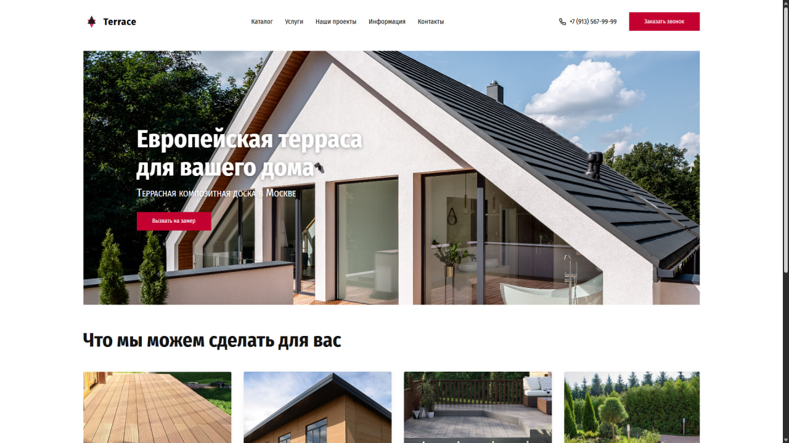

Одностраничный адаптивный лендинг строительной компании Terrace по тестовому заданию в веб-студию. Все данные вымышлены, проект доступен на Vercel. Ссылка:

Реализованы: адаптивная верстка(3 брейкпоинта) по макету подходом desktop-first, модалка с формой обратной связи+валидация полей, горизонтальный скролл карточек услуг по правилам семантической верстки. 
Верстку выполнял по принципу БЭМ, код читаемый и стили могут переиспользоваться. JS логика изолирована в IIFE, глобальная область чистая. В стилях юзал clamp() и rem вместо px.

Стек: 
HTML5
CSS - (БЭМ, Flexbox, rem/clamp, медиазапросы)
JavaScript - (нативный, управление DOM, валидация)
Git, Vercel - деплой

Запуск проекта:
1. Скачайте этот репозиторий
2. Откройте index.html в браузере

Кроссбраузерность:
Проект проверен в Chrome, Safari(iOS).
